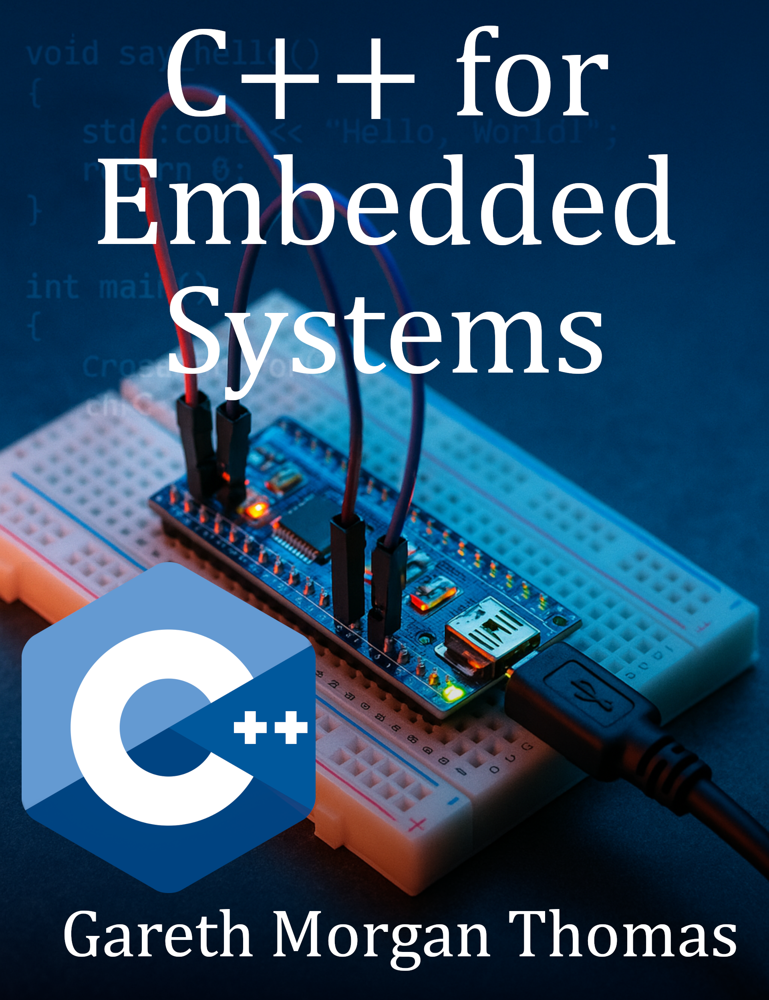

# C Plus Plus For Embedded Systems

### Cover

### Repository Structure
- `covers/`: Book cover images
- `blurbs/`: Promotional blurbs
- `infographics/`: Marketing visuals
- `source_code/`: Code samples
- `manuscript/`: Drafts and format.txt for TOC
- `marketing/`: Ads and press releases
- `additional_resources/`: Extras

View the live site at [burstbookspublishing.github.io/c-plus-plus-for-embedded-systems](https://burstbookspublishing.github.io/c-plus-plus-for-embedded-systems/)
---

## Chapter 1. Introduction to Embedded Systems with C++
### Section 1. Overview of Embedded Systems
- Defining Embedded Systems and Applications
- Embedded vs. General-Purpose Programming
- The Role of C++ in Embedded Development

### Section 2. Setting Up the Development Environment
- Choosing the Right Tools (IDE, Compiler, Debugger)
- Setting Up Toolchains for Embedded C++
- Cross-Compiling for Target Devices

### Section 3. Basics of Embedded C++
- C++ Features Suitable for Embedded Systems
- Differences from Standard C++ Development
- Common Constraints in Embedded Environments

---
## Chapter 2. C++ Language Essentials for Embedded Systems
### Section 1. Data Types and Memory Management
- Fixed-Width Integer Types and Bit Manipulation
- Memory Allocation and Stack Management
- Using const and volatile for Hardware Access

### Section 2. C++ Standard Library Limitations
- Choosing STL Components for Embedded Systems
- Minimizing Memory Overhead
- Writing Custom Data Structures

### Section 3. Real-Time Programming Essentials
- Understanding Real-Time Requirements
- Meeting Deadlines and Minimizing Latency
- Trade-offs Between Code Size and Execution Speed

---
## Chapter 3. Hardware and Device Interfaces
### Section 1. Working with Microcontrollers
- Understanding Microcontroller Architecture
- Basics of GPIO (General-Purpose Input/Output)
- Interfacing with LEDs, Buttons, and Sensors

### Section 2. Communication Protocols
- Introduction to UART, I2C, and SPI
- Implementing Protocols in C++
- Communication Between Microcontrollers and Sensors

### Section 3. Direct Memory Access (DMA) and Peripheral Interfaces
- Basics of DMA and Its Applications
- Setting Up DMA in Embedded C++
- Efficiently Handling Peripheral Communication

---
## Chapter 4. Interrupts and Real-Time Constraints
### Section 1. Basics of Interrupt Handling
- Introduction to Interrupts and ISRs
- Configuring and Prioritizing Interrupts
- Minimizing Latency in Interrupts

### Section 2. Real-Time Operating Systems (RTOS)
- Choosing an RTOS for Embedded C++ Projects
- Task Scheduling and Real-Time Constraints
- Integrating C++ with FreeRTOS or Zephyr

### Section 3. Synchronization in Real-Time Systems
- Working with Semaphores and Mutexes
- Handling Critical Sections and Deadlocks
- Best Practices for RTOS Synchronization

---
## Chapter 5. Power Management and Optimization
### Section 1. Power Management Techniques
- Understanding Power Modes in Microcontrollers
- Techniques for Reducing Power Consumption
- Handling Sleep and Wake-up Sequences

### Section 2. Code Optimization for Low Power
- Minimizing Code Size and Execution Time
- Profiling Power Consumption
- Trade-offs Between Power and Performance

### Section 3. Optimizing Memory Usage
- Memory Allocation Strategies for Embedded Systems
- Using Flash and EEPROM for Data Storage
- Avoiding Memory Fragmentation

---
## Chapter 6. Low-Level Programming in C++
### Section 1. Register-Level Programming
- Accessing Hardware Registers in C++
- Using Bitwise Operations for Register Manipulation
- Direct Memory Access and Mapping

### Section 2. Writing and Optimizing Firmware
- Structuring Code for Firmware Development
- Handling System Initialization and Bootloaders
- Firmware Updating and Over-the-Air (OTA) Updates

### Section 3. Error Handling and Diagnostics
- Handling Errors in Resource-Constrained Systems
- Implementing Diagnostic Routines
- Logging and Debugging Techniques for Embedded Firmware

---
## Chapter 7. Interfacing with IoT Devices
### Section 1. Overview of IoT in Embedded Systems
- Introduction to Embedded IoT Devices
- Networking Basics for Embedded C++
- Secure Communication in IoT

### Section 2. Wireless Communication Protocols
- Implementing Bluetooth Low Energy (BLE)
- Using Wi-Fi for Embedded Systems
- Working with LoRa and Zigbee Protocols

### Section 3. Building an IoT Project with C++
- Setting Up an Embedded IoT Device
- Gathering and Sending Sensor Data
- Interfacing with Cloud Platforms

---
## Chapter 8. Advanced C++ Techniques for Embedded Systems
### Section 1. Using Modern C++ in Embedded Applications
- Pros and Cons of C++11/14/17 Features in Embedded
- Leveraging constexpr, auto, and lambda expressions
- Practical Examples of Modern C++ in Firmware

### Section 2. Metaprogramming for Efficiency
- Basics of Compile-Time Computation
- Using Templates for Efficient Code
- Reducing Runtime Overhead with Metaprogramming

### Section 3. Design Patterns for Embedded Systems
- Implementing Singleton, State, and Observer Patterns
- Choosing Lightweight Patterns for Resource Constraints
- Practical Use Cases in Embedded Projects

---
## Chapter 9. Testing, Debugging, and Deployment
### Section 1. Unit Testing for Embedded Systems
- Using C++ Unit Testing Frameworks for Embedded Code
- Testing Hardware Interfaces and Protocols
- Mocking and Simulating Hardware for Tests

### Section 2. Debugging Embedded Applications
- Using Serial Debugging and Print Statements
- Debugging with JTAG and SWD Interfaces
- Analyzing Core Dumps and Stack Traces

### Section 3. Deployment and Maintenance
- Writing a Bootloader for Firmware Updates
- Over-the-Air (OTA) Deployment Techniques
- Maintenance and Version Control in Embedded Projects

---
## Chapter 10. Practical Projects and Case Studies
### Section 1. Developing Firmware for Microcontrollers
- Project Setup and Requirements Analysis
- Implementing and Testing Core Firmware Functions
- Performance Optimization Techniques

### Section 2. Creating an Embedded IoT Device
- Building an IoT Application with Sensors and Actuators
- Interfacing with a Cloud Platform
- Power Management in IoT Projects

### Section 3. Case Study: Real-Time Monitoring System
- Designing a Real-Time Embedded Monitoring Solution
- Handling Data Collection and Processing
- Ensuring Reliability and Accuracy in Monitoring
---
